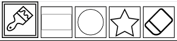
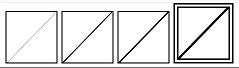
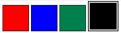

# DrawingApp
A simple front-end mouse drawing app that only uses pure html, js and css.
Written for a weekly front-end coding challenge.

📝 Project Description
Create digital artwork on a canvas on the web to share online and also export as images.

📔 User Stories
1. User can draw in a canvas using the mouse
2. User can change the color
3. User can change the size of the tool
4. User can press a button to clear the canvas

⭐ Bonus features (optional)
1. User can save the artwork as an image (.jpg)
2. User can draw different shapes (rectangle, circle, star)

There's a limited number of tools to choose from.  
User can veiw which tool he's currently selected.  
It's a brush in the image bellow:  
  
User can draw with a brush by just holding down the mouse or pick a  
shape. If a shape is chosen, use can click on canvas and  
drag his mouse. When mouse is released the chosen shape is drawn.  
  
User can choose line width among the following 4,  
which are 1px, 5px, 10px and 15px respectively:  
  
  
User can choose among these 4 colors:  
  
  
User can download his canvas as a .jpg image file  
or clear his drawing if he doesn't like it:  
  
